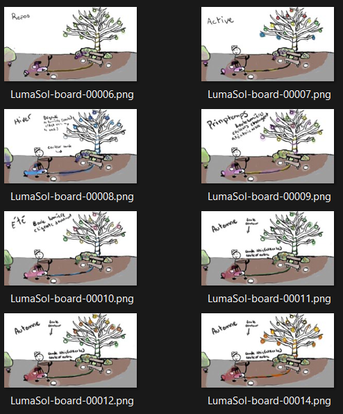

# projets des étudiants  

## 1. Echomarine

### Lien du projet avec mysélium:
sensibiliser les gens au fait que plusieurs animaux marins son en voit de disparition ou en danger à l'aide de vidéo interactive
### créateur/créatrise

Florence Lapierre 

Natacha Abadallah

Tracy Gua

Maria Laura Cornel

### installation du projet dans le studio:
####  photos prise avant l'installation final dans le studio

####  photo prise lors de l'exposition qui montre mieux l'environement du studio

### schéma

(source:https://tim-montmorency.com/2023/projets/Echomarine/docs/web/index.html)
### cours du programme qui sont incontournable pour créé ce projet
1.audio 2: Permet d'utiliser tout les outils sonore pour réaliser un projet sonore intéractif
2. programmation intératif: Réalisation d'applications interactives simples a l'aide de la programmation
3. modéalisation 3D: Effectuer le montage d'animations 3D
### présentation d'une technique ou composante technologique
After Effect 2022 est une application qui permet d'animer des textes ou des images.
### Resenti général
J'ai aimé voir que lorsqu'on interagi avec la tablette est on clique sur un animal marin on ne sait pas ou il va apparaitre. On a vraiment l'impression d'être dans les font marin.
## 2.zodie-Gal

### Lien du projet avec mysélium:
un jeu dans le quelle il faut aider une jeune fille à renter chez elle
### créateur/créatrise 
 abdanor yara

### installation du projet dans le studio:
 #### photos prise avant l'installation final dans le studio:
 
#### photo prise lors de l'exposition qui montre mieux l'environement du studio
 

 ### schéma:
### cours du programme qui sont incontournable pour créé ce projet:
1.desing graphique:Concevoir le desing de la page-écran.
2.intéractif ludique:Réalisation d' une expérience ludique intégrant images et échantillons sonores dans laquelle l‘interacteur progresse en accomplissant des actions.
3. web 2:Créer une interface Web fluide et adaptative.

### présentation d'une technique ou composante technologique
cliping studio est une application qui permet de faire des illustration de dessin,animation,peinture etc
### Resenti général
J'ai bien aimé qu'il s'agisse d'un jeu (point and clic) qui est lié aux signes du zodiaque.
le seul point négatif que je donne a ce projet est que je ne vois pas bien le lien qu'il a avec la thématique mycélium
## 3.edria

### Lien du projet avec mysélium : 
La dualiter entre la nature et la technologie
### créateur/créatrise
Loic Delorme: l'intération du projet

 Dominic Roberts:cordinateur de l'instalation du projet

 Gabriel leblanc: s'occupe des poteau qui vont être instaler a l'extérieur

 Meryem Berbiche:cordonatrise de l'interactiviter et du contenu du projet
 
 Jean-christophe: concepteur sonore du projet
 

### photos prise avant l'instalation final dans le studio

### photo prise lors de l'exposition qui montre mieux l'environement du studio

 
 
 ### schéma:
 
 sources:(https://tim-montmorency.com/2023/projets/EDRIA/docs/web/index.html)
### cours du programme qui sont incontournable pour créé ce projet
1. audio 1:Réaliser un montage sonore multipiste stéréophonique.
2. Œuvres et dispositifs multimédias en exposition:Documenter la mise en exposition d’œuvres et de dispositifs multimédias.
3.Installation multimédia:Réaliser une installation multimédia à grande échelle sur mesure.
### présentation d'une technique ou composante technologique:
FL Studio est un logiel qui permet de composer sa prorpe muisique et de faire plusieurs effets sonores.
### Resenti général
J'ai bien aimer que les colones réagiste aux contacts des gens qui ce rapporche avec différent effet lumineux et sonore.

## 4.Nexum

### Lien du projet avec mysélium :
permet la connexion entre l'humain et son espace tout en plongent dans un univers immersif
### créateur/créatrise
Sébastien Reilly: coordonateur géneral

sabrina laforest: responsable des code QR

alexendre daniel:chef d'équipe

Maximes des laurier:cordonateur technique

 ### instalation du projet dans le studio:
 #### photos prise avant l'installation final dans le studio
  
 #### photo prise lors de l'exposition qui montre mieux l'environement du studio

 (https://tim-montmorency.com/2023/projets/Nexum/docs/web/index.html)
 
### schéma:
 
### cours du programme qui sont incontournable pour créé ce projet:
1.Installation multimédia:Réaliser une installation multimédia à grande échelle sur mesure.
2.Programmation interactive: Réaliser des applications interactives simples à l’aide de la programmation.
3.Audio 2: Réaliser un projet sonore interactif.

### présentation d'une technique ou composante technologique
 procreate est un logiciel qui permet de faire des dessin et des animmation 3d
### Resenti général
j'ai bien aimer l'idée de pouvoir intéragir avec l'oeuvre grace aux code QR.

## 4.lumasol

### Lien du projet avec mysélium:
montrer l'importance pour l'humains de demeurer en contact avec la nature en raison de l'urgence climatique
### créateur/créatrise
eloise gagne

skyla stimphil

michael simard

penelope Morrison

 ### instalation du projet dans le studio:
 ### photos prise avant l'installation final dans le studio
  
### photo prise lors de l'exposition qui montre mieux l'environement du studio
 
 
 ### schéma: 
 
 sources:(https://tim-montmorency.com/2023/projets/LumaSol/docs/web/index.html)
### cours du programme qui sont incontournable pour créé ce projet:
1.Audio 2: Réaliser un projet sonore interactif.
2.Installation multimédia:Réaliser une installation multimédia à grande échelle sur mesure.
3.Traitement audiovisuel:Réaliser un projet audiovisuel interactif personnel sur un dispositif commun.

### présentation d'une technique ou composante technologique
Visual studio code est un programme qui permet de faire du codage.

### Resenti général
j'ai aimé que l'oeuvre utilise un vélo pour la faire fonctioner les Lumières.
### référence 
https://tim-montmorency.com/2023/
