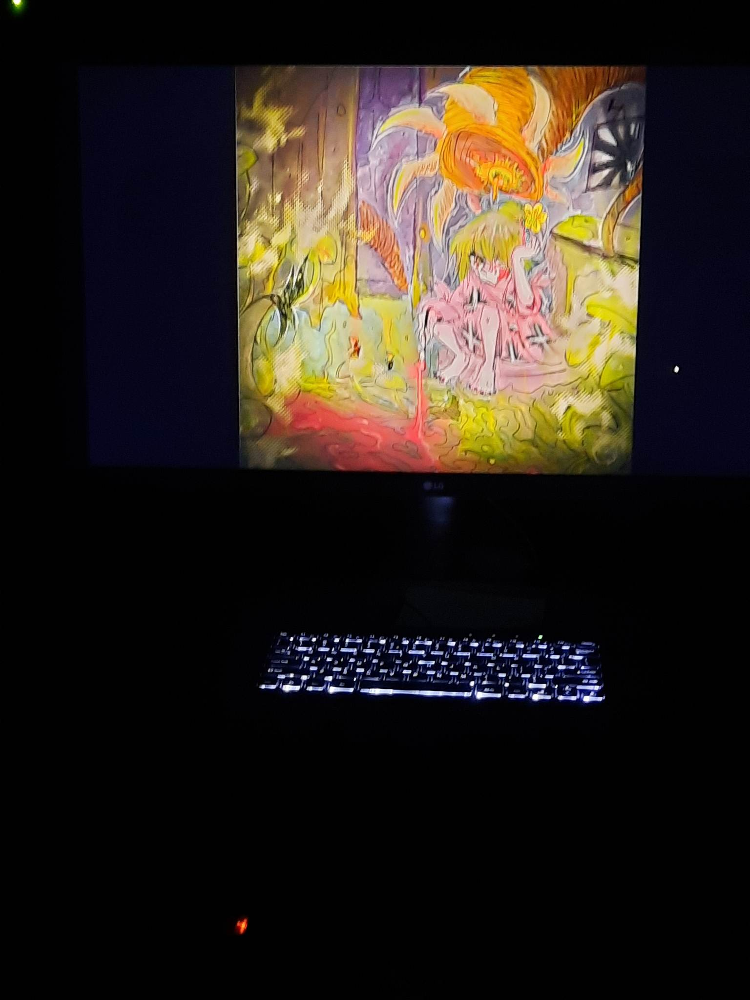

# projet des étudiants 

## 1. Echomarine

### Lien du projet avec mysélium:
sensibiliser les gens au fait que plusieurs animaux marin son en voit de disparition ou en danger à l'aide de vidéo intéractives
### créateur/créatrise

Florence Lapierre 

Natacha Abadallah

Tracy Gua

Maria Laura Cornel

### instalation du projet dans le studio:
### photos prise avant l'instalation final dans le studio

### photo prise lors de l'exposition qui montre mieux l'environement du studio

 vidéo qui montre l'oeuvre en action

### schéma

(source:https://tim-montmorency.com/2023/projets/Echomarine/docs/web/index.html)
### cours du programme qui sont incontournable pour créé ce projet
1.audio 2: Permet d'utiliser tout les outils sonore pour réaliser un projet sonore intéractif
2. programmation intératif: Réalisation d'applications interactives simples a l'aide de la programmation
3. modéalisation 3D: Effectuer le montage d'animations 3D
### Resenti général

## 2.zodie-Gal

### Lien du projet avec mysélium
### créateur/créatrise 
 abdanor yara

### instalation du projet dans le studio:
 photos prise avant l'instalation final dans le studio:
 
 photo prise lors de l'exposition qui montre mieux l'environement du studio
 

 ### schéma:
### cours du programme qui sont incontournable pour créé ce projet:
1.desing graphique:Concevoir le desing de la page-écran.
2.intéractif ludique:Réalisation d' une expérience ludique intégrant images et échantillons sonores dans laquelle l‘interacteur progresse en accomplissant des actions.
3. web 2:Créer une interface Web fluide et adaptative.
### Resenti général

## 3.edria

### Lien du projet avec mysélium :
### photos prise avant l'instalation final dans le studio

### photo prise lors de l'exposition qui montre mieux l'environement du studio

 vidéo qui montre l'oeuvre en action
### créateur/créatrise
Loic Delorme: l'intération du projet

 Dominic Roberts:cordinateur de l'instalation du projet

 Gabriel leblanc: s'occupe des poteau qui vont être instaler a l'extérieur

 Meryem Berbiche:cordonatrise de l'interactiviter et du contenu du projet
 
 Jean-christophe: concepteur sonore du projet
 
### instalation du projet dans le studio:
 ### photos prise avant l'instalation final dans le studio
### photo prise lors de l'exposition qui montre mieux l'environement du studio
 vidéo qui montre l'oeuvre en action
 ### schéma:
 
 sources:(https://tim-montmorency.com/2023/projets/EDRIA/docs/web/index.html)
### cours du programme qui sont incontournable pour créé ce projet
1. audio 1:Réaliser un montage sonore multipiste stéréophonique.
2. Œuvres et dispositifs multimédias en exposition:Documenter la mise en exposition d’œuvres et de dispositifs multimédias.
3.Installation multimédia:Réaliser une installation multimédia à grande échelle sur mesure.
### Resenti général

## 4.Nexum

### Lien du projet avec mysélium :
permet la connexion entre l'humain et son espace tout en plongent dans un univers immersif
### créateur/créatrise
Sébastien Reilly: coordonateur géneral

sabrina laforest: responsable des code QR

alexendre daniel:chef d'équipe

Maximes des laurier:cordonateur technique

 ### instalation du projet dans le studio:
 ### photos prise avant l'instalation final dans le studio
 ### photo prise lors de l'exposition qui montre mieux l'environement du studio
 vidéo qui montre l'oeuvre en action
 
### schéma:

### cours du programme qui sont incontournable pour créé ce projet:
1.Installation multimédia:Réaliser une installation multimédia à grande échelle sur mesure.
2.
3.
### Resenti général

## 4.lumasol

### Lien du projet avec mysélium:
montrer l'importance pour l'humains de demeurer en contact avec la nature en raison de l'urgence climatique
### créateur/créatrise
eloise gagne

skyla stimphil

michael simard

penelope Morrison

 ### instalation du projet dans le studio:
 ### photos prise avant l'instalation final dans le studio
### photo prise lors de l'exposition qui montre mieux l'environement du studio
 vidéo qui montre l'oeuvre en action
 ### schéma: 
 
 sources:(https://tim-montmorency.com/2023/projets/LumaSol/docs/web/index.html)
### cours du programme qui sont incontournable pour créé ce projet:
1.
2.
3.
### Resenti général
