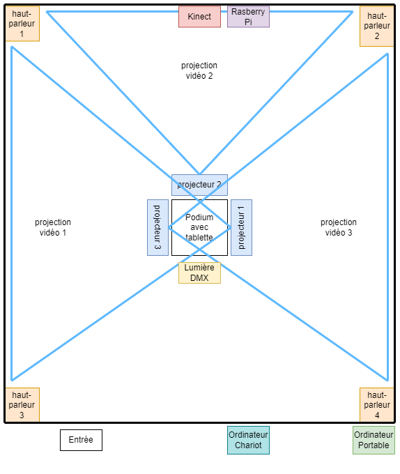

# projet des étudiants 

## 1. Echomarine

### Lien du projet avec mysélium
### créateur/créatrise

Florence Lapierre 

Natacha Abadallah

Tracy Gua

Maria Laura Cornel

### instalation du projet dans le studio

### schéma

### cours du programme qui sont incontournable pour créé ce projet
1. ilustration numérique 
2. audio
3. modélisation 3D

## 2.zodie-Gal

### Lien du projet avec mysélium
### créateur/créatrise 
 abdanor yara

### instalation du projet dans le studio
### schéma
### cours du programme qui sont incontournable pour créé ce projet

## 3.edria

### Lien du projet avec mysélium
### créateur/créatrise
Loic Delorme

 Dominic Roberts

 Gabriel leblanc

 Meryem Berbiche
 
 Jean-christophe
 
 ### instalation du projet dans le studio
 ### schéma
### cours du programme qui sont incontournable pour créé ce projet

## 4.Nexum

### Lien du projet avec mysélium
### créateur/créatrise
Sébastien Reilly

sabrina laforest

alexendre daniel

Maximes des laurier

 ### instalation du projet dans le studio
 ### schéma
### cours du programme qui sont incontournable pour créé ce projet

## 4.lumasol

### Lien du projet avec mysélium
### créateur/créatrise
eloise gagne

skyla stimphil

michael simard

penelope Morrison

 ### instalation du projet dans le studio
 ### schéma
### cours du programme qui sont incontournable pour créé ce projet
