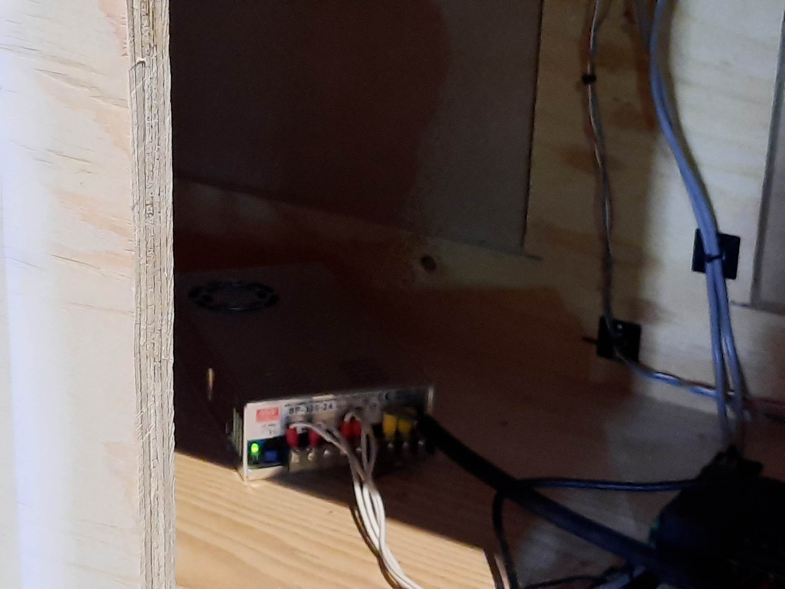
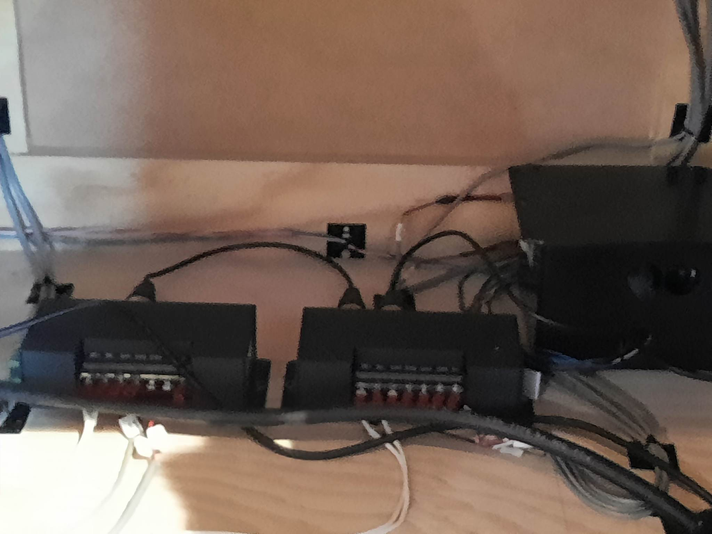

# Sortie au centre des science de Montréal

#
Photos prise le 12 avril 2023 devant le centre des sciences lors de la visite de l'exposition.
# Type d'exposition
Il s'agit d'une exposition permanete intérieur dans le centre des sciences de Montréal.

# l'évolution c'est du bricolage

#
le dispositif dispose de 10 petite porte intéractive dans les quelle y a des informations sur l'évolution du corps humain.
c'est également un exposition du type permanent.

# Description du dispositf

#
le cartel explique en francais et anglais l'évolution des humains aux jeune enfants tout les faisent participer a un jeu éducatif en soulevent des plaquette pour trouver les bonnes réponse.

# Type d'instalation
Ce dispositif est un dispostif intéractif puisqu'ils est situé dans le centre des sciences de Montréal un lieu très répendu pour faire apprendre les jeunes s'enfants des choses sur différent type de sciences.

# Fonction du dispositif
les fonctions du dispositifs est d'etre pédagogiques puisqu'il a pour but d'instruires les enfants sur l'évolution sur chaque porte il y a une partie du corps
et quand ont soulevre la porte il y a encore plus d'information sur l'évolution de cette partie du corps.
# Mise en espace

#
le disposit est coller contre un mur a l'entrée de l'exposition humain.
# composantes et techniques

#  Expérience vécue
Ce qui est attendu de la part des visiteurs c'est qu'ils trouvent les quatres compétence qui sont permit a l'humain de s'adapter on fil du temps mais en faissent attention de pas trouver une compétence qui n'est plus utilile pour l'humain. il ya des bruit différent si ont trouve la bonne ou mauvais réponse.
# Point aprécier 
j'ai aimé que c'était un jeu de à choix multipe et qu'il y est du son pour savoir si chaque réponse était bonne ou mauvais.
# Chose a changé
La chose que j'ai moins apresier c'est l'emplace choisi. le fait que le dispostif sois coller a un 
