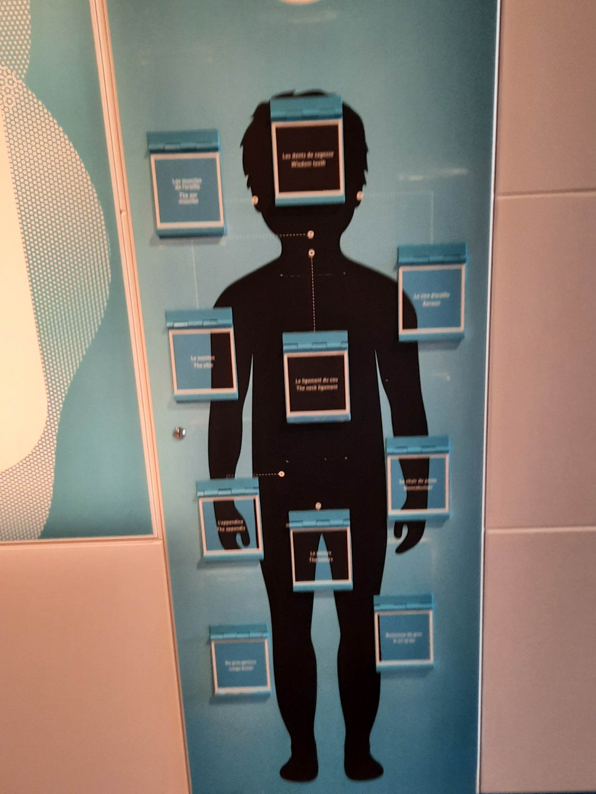
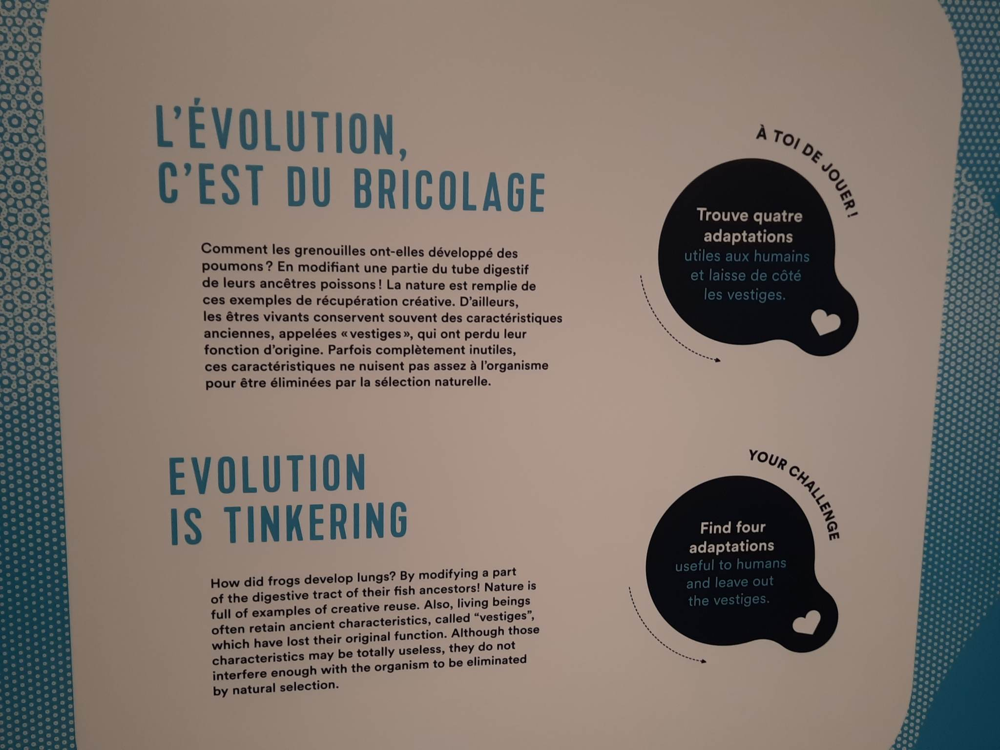

# Sortie au centre des science de Montréal

#
Photos prise le 12 avril 2023 devant le centre des sciences lors de la visite de l'exposition.

# l'évolution c'est du bricolage

#
le dispositif dispose de 10 petite porte intéractive dans les quelle y a des imformations sur l'évolution du corps humain.

# Description du dispositf

#
le cartel explique en francais et anglais l'évolution des humains aux jeune enfants tout les faisent participer a un jeu éducatif en soulevent des plaquette pour trouver les bonnes réponse.
