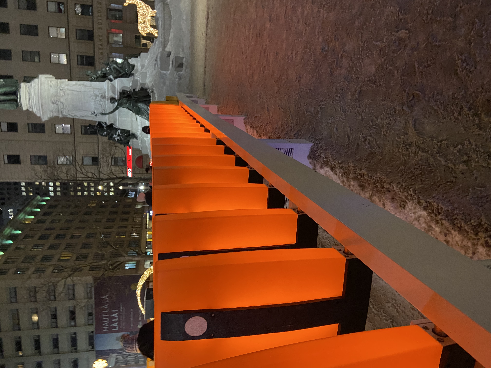
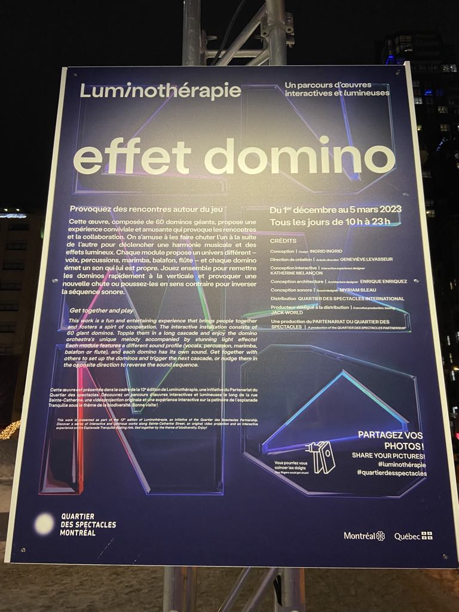
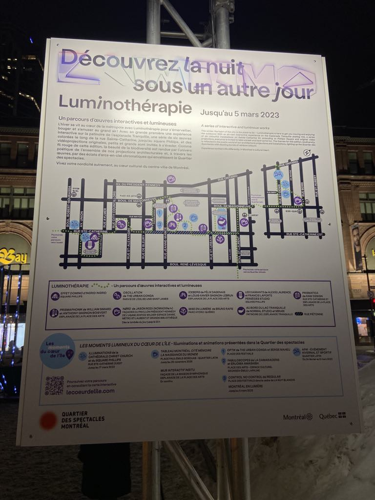

# Lumino Thérapie

## lieu de mise en exposition

##
l'exposition a lieu dans le centre ville de Montréal dans le parc de square phillips dans le quartier des spectacles

## Type d'exposition 
Le type d'exposition de effet domino est une exposition temporaire qui est disponible du 22 novembre 2023 au 5 mars 2023 uniquement disponible a l'extérieur.

## Titre de l'oeuvre 

## 
Photo de l'ensemble de l'effet domino 

## Nom de l'artiste ou de la firme 
La frime ingrid ingrid son les créateurs du disposif effet domino

## Description du dispositif

##
