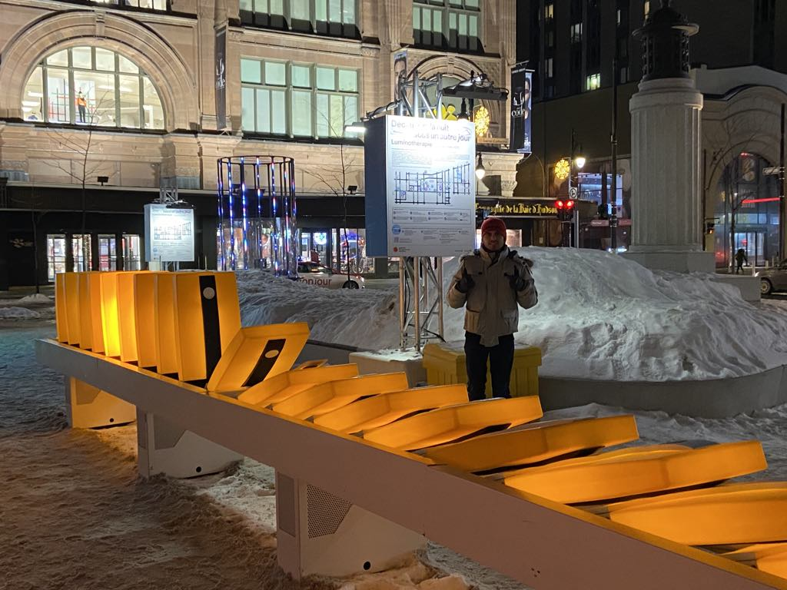
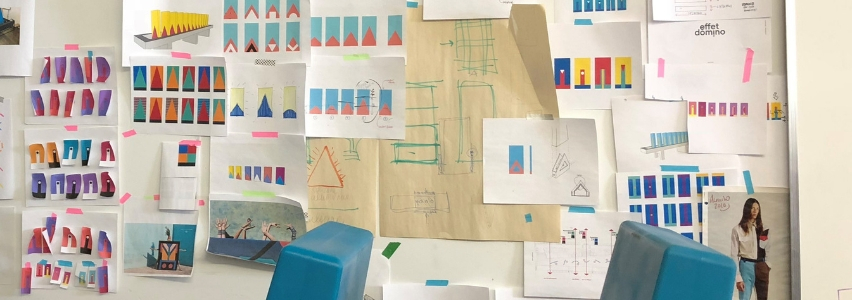

# Lumino Thérapie

## Lieu de mise en exposition

##
l'exposition a lieu dans le centre ville de Montréal dans le parc de square phillips dans le quartier des spectacles

## Type d'exposition 
Le type d'exposition de effet domino est une exposition temporaire qui est disponible du 22 novembre 2023 au 5 mars 2023 uniquement disponible a l'extérieur.

## Titre de l'oeuvre 

## 
Photo de l'ensemble de l'effet domino. 

## Nom de l'artiste ou de la firme 
La frime ingrid ingrid son les créateurs du disposif effet domino
Direction de création : Geneviève Levasseur
Conception interactive : Katherine Melançon
Conception architecture : Enrique Enriquez
Conception lumière : Lightfactor Inc.
Conception sonore : Myriam Bleau
Conception technologique et électronique : Productions Version 10
Design industriel : DIX au carré
Fabrication Solufab, Rotoplast et Nordesco
Production : Partenariat du Quartier des spectacles.

## Description du dispositif

##
Le but principal de l'effet domino est d'avoir un lien avec le plublic de le rassembler mais aussi de leurs faire oublier les étempérier de l'hiver. c'est l'un des premier dispositif intéractif extérieur qui est possible de manipuler avec les mains,dans le dispositif effet domino il y a en tout 60 dominos multicolore qui font différent bruit tels: voix,percusion, manbrat,balafon et flute.

## Type d'installation
Effet domino est un installation intéractif qui permet de faire bouger des dominos. le but principal est de les faire tomber.

## Fonction du dispositif
Faire bouger des dominos pour faire du bruit et ce changer les idée.
## Mise en espace

effet domino, Luminotherapie. (Crédit photo : JALQ Photography. Gracieuseté du Quartier des)
## composantes et techniques

## 
Il y a des haut parleur insérer dans le dispositif ainsi que des néon ou empoule. plus une vidéo qui montre tous les composant  à l'intérieurs
## croquis

(credit ingrid ingrid)
##
tout les croquis utiliser par la compagine ingrid ingrid pour créé l'effet domino.

## Expérience vécu
l'expérience que doivent faire les visiteurs est simplement. il doivent jouer avec les domino pour pouvoir faire du bruit et voir les différente couleurs du dispositif changer. j'ai personellement essayer les trois différent effet domino est je n'ais presque auqu'une différence entre chaque.
## La chose qui m'a plus 
La chose qui m'a le plus dans effet domino c'est le choix de couleurs vive son vraiment belle. si vous avez l'intension d'aller voir l'oeuvre aller la voir en soir puisque les dominos son illuminer le soir.
## Aspect négatif 
J'ai trouver que le site de l'expostion était plutot petit. l'exposition en moins 10 minute tu a tu vue. c'est mal placer il faut traverser une roue ou beaucoup de voitures pas et ça peut être très dangereux pour les enfants.
## Référence
https://www.quartierdesspectacles.com/fr/medias/luminotherapie-effet-domino
https://www.quartierdesspectacles.com/fr/a-propos/les-productions-du-partenariat/oeuvre/75/effet-domino-par-ingrid-ingrid/
https://qdsinternational.com/installations/effet-domino/
http://ingrid-ingrid.com/fr_effetdomino
https://montrealsecret.co/luminotherapie/
